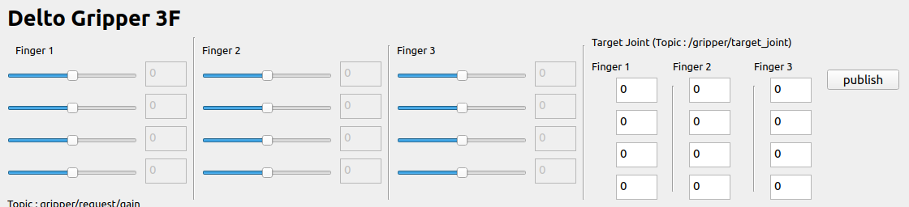
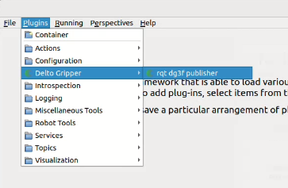

# RQT DG3F Publisher Plugin Documentation
## Overview


This RQT plugin provides a graphical interface for controlling and monitoring a three-fingered robotic gripper. It features joint control, visualization, and real-time plotting capabilities.


This is just a topic publisher, and to actually operate the gripper, it needs to be connected to the delto_3f_driver.

## install

```bash
cd your_ros2_ws/
colcon build
rqt --force-discover
```

## ROS2 Communication

### Publishers

|Topic Name|Message Type|Description|
|---|---|---|
|`gripper/target_joint`|Float32MultiArray|Target joint angles for the gripper|
|`gripper/grasp`|Bool|Gripper grasp command (True/False)|
|`gripper/idle_target_joint`|Float32MultiArray|Idle position target joints|
|`gripper/write_register`|Int16MultiArray|Register write commands|
|`gripper/request/gain`|Int16MultiArray|PD gain settings for joints|
|`gripper/fixed_joint`|Int16MultiArray|Fixed joint configuration|

### Subscribers

|Topic Name|Message Type|Description|
|---|---|---|
|`/gripper/joint_states`|JointState|Current joint states of the gripper|

## Data Structure

### Joint Data Format

- Total 12 joints (3 fingers × 4 joints each)
- Joint angles in radians (internally) and degrees (UI display)
- Array index mapping:
    - Finger 1: indices 0-3
    - Finger 2: indices 4-7
    - Finger 3: indices 8-11

## Visualization Components

### Real-time Plots

Each finger has its own plot showing:

- Current joint angles (solid lines)
- Target joint angles (dashed lines)
- Color coding:
    - Red: Joint 1
    - Blue: Joint 2
    - Green: Joint 3
    - Yellow: Joint 4

## Control Features

### Joint Control

1. Manual Control
    - Individual joint sliders
    - Direct value input through text fields
2. Grasp Control
    - Grasp button: Initiates grasping motion
    - Ungrasp button: Releases grasp

### Gain Control

- PD gain adjustment for each joint
- Save functionality for gain values
- Gain structure:
    - P gain range: 0-1000
    - D gain range: 0-1000

### Fixed Joint Configuration

- Enable/disable individual joints
- Binary state (0: free, 1: fixed)